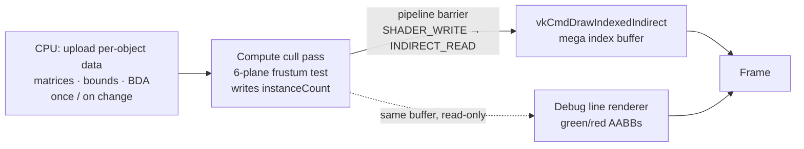

# GPU-Driven Vulkan Renderer

> A Vulkan 1.3 renderer that moves the *"what to draw"* decision from the CPU to the GPU — GPU compute frustum culling feeding `vkCmdDrawIndexedIndirect`, with **zero CPU readback** and a custom in-engine GPU profiler.

**Batching + indirect draw: `1706 → ~34` draw calls. Compute culling: geometry GPU time ↓ (see [Performance](#performance)).**

<!-- TODO: hero GIF — frozen-frustum culling, objects turning red then culled as they cross the frozen frustum. 8–12s loop, drop at docs/hero.gif -->


---

## What & Why

I built this from the ground up to master the modern AAA **GPU-driven** rendering architecture, where the CPU only uploads per-object data once and the **GPU itself decides what is visible and issues the draws**. Instead of the CPU looping over every object each frame to cull and record draw calls, a compute shader culls against the view frustum and writes the surviving instance counts straight into an indirect draw buffer. The result never travels back to the CPU — the same buffer that drives the indirect multidraw is also read by the debug line renderer for visualization.

This scales with the number of *visible* objects rather than the *total* object count, which is why it's the foundation of engines that render huge scenes.

## Key Features

- **GPU-driven pipeline** — compute frustum culling writes `instanceCount` into the indirect command buffer, consumed directly by `vkCmdDrawIndexedIndirect`. No CPU readback of visibility.
- **6-plane frustum culling** — planes extracted from the view-projection matrix (Gribb–Hartmann), AABB tested with the p-vertex method, all on the GPU.
- **Mega index buffer + per-mesh Buffer Device Address** — a single merged index buffer for indirect multidraw, with bindless-style vertex fetch via BDA per mesh.
- **Per-object data in SSBO** — render matrices, bounds and vertex-buffer addresses live in a GPU storage buffer indexed by instance.
- **Custom in-engine GPU profiler** — timestamp queries with a live on-screen graph of per-pass GPU time (CPU-side `std::chrono` isn't enough to measure GPU work).
- **Culling debug visualization** — freeze the frustum and fly a separate camera; AABBs turn **green (kept) / red (culled)** by reading the GPU culling result, plus a magenta frustum wireframe.
- **Vulkan 1.3 baseline** — dynamic rendering, synchronization2, and VMA for allocation.

## Architecture

The draw decision lives entirely on the GPU. Visibility is written by a compute pass and consumed by the indirect draw without ever round-tripping to the CPU.



**Key point:** the culling result stays in GPU memory. The CPU never learns which objects were culled — it only records one indirect multidraw whose per-draw `instanceCount` was set by the GPU.

## Performance

Measured with the in-engine GPU timestamp profiler. <!-- TODO: fill numbers from a benchmark run; capture on one machine, one fixed camera path -->

| Configuration | Draw calls | Triangles | GPU geometry time |
|---|---:|---:|---:|
| Naive (per-object draws) | 1706 | `TODO` | `TODO` |
| + Instancing + mega index + indirect multidraw | ~34 | `TODO` | `TODO` |
| + GPU compute culling (**main result**) | ~34 * | `TODO ↓` | `TODO ↓` |

<sub>* Draw-call count is unchanged by culling in the current masked implementation — culled objects still submit an empty draw, so the culling win shows up in **triangles / GPU time**. True draw-call reduction comes with stream compaction (see Roadmap).</sub>

<!-- TODO: profiler HUD screenshot (gpu_ms line graph) at docs/profiler.png -->
<!--  -->

## Build

Windows / Visual Studio, Vulkan SDK 1.3+ required.

```bash
git clone https://github.com/NingSun-pixel/vulkan-gpu-driven-renderer.git
cd vulkan-gpu-driven-renderer
cmake -B Build
cmake --build Build
```

<!-- TODO: adjust repo name above if you named it differently; add any SDK/env notes -->

## Roadmap

Honest next steps, roughly in order:

- **PBR + shadow mapping** — Cook–Torrance GGX shading and a directional-light shadow pass (currently Lambert).
- **Stream compaction** (`atomicAdd` + `IndirectCount`) — collapse culled draws so the draw-call count itself drops.
- **Hi-Z occlusion culling** — depth-pyramid test to reject objects hidden behind others.
- **Two-level cluster culling** (cluster → instance) — the pragmatic, GPU-friendly hierarchy.
- **Android + Snapdragon profiling** — run the same benchmark matrix on mobile.

## Credits

Bootstrapped from the excellent [vkguide.dev](https://vkguide.dev) base by [vblanco20-1](https://github.com/vblanco20-1/vulkan-guide) (MIT). The **GPU-driven culling pipeline, the compute/indirect architecture, the custom GPU profiler, and the culling debug visualization are my own work** built on top of that starting point.

## About

<!-- TODO: one-line differentiator + contact -->
Graphics programming portfolio project. Contact: yulinsun6920@gmail.com
