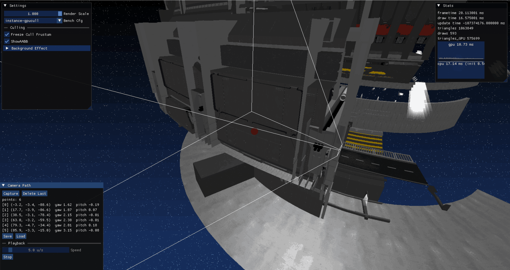
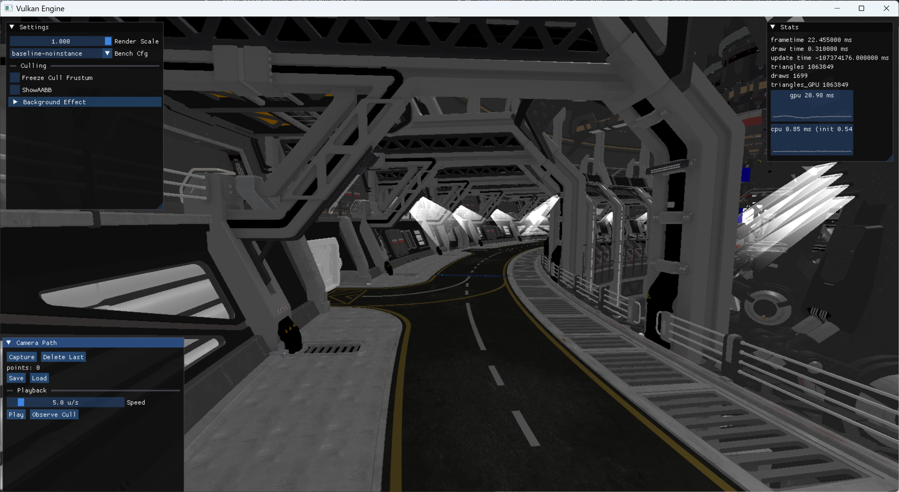
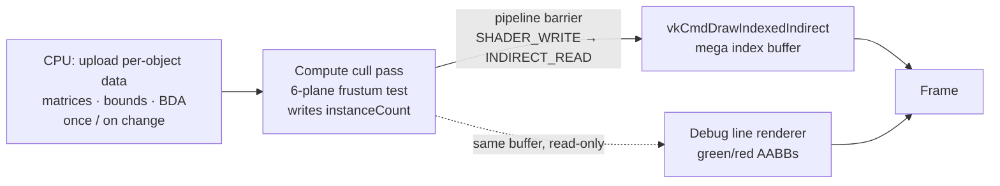
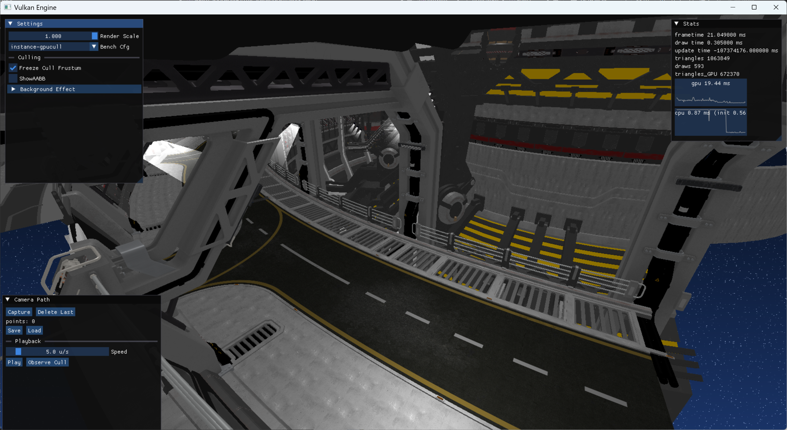
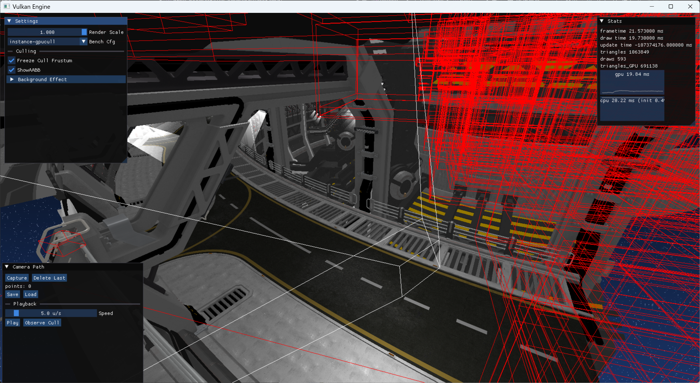
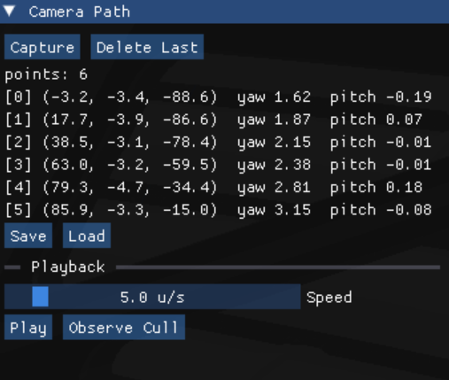
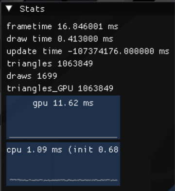
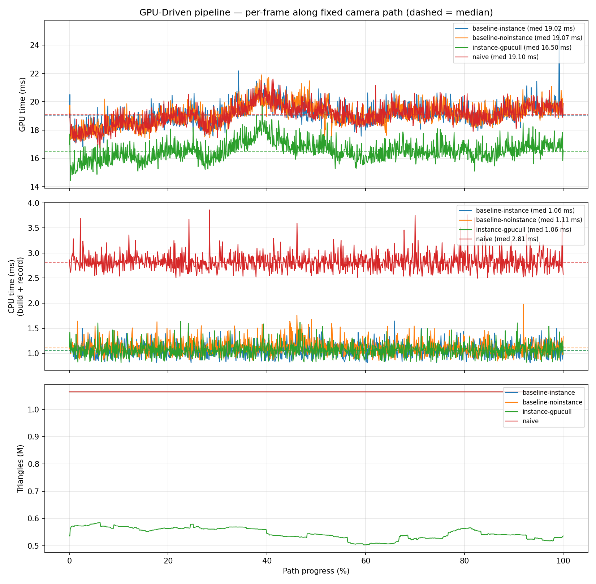

# GPU-Driven Vulkan Renderer

> A Vulkan 1.3 renderer that moves the *"what to draw"* decision from the CPU to the GPU — GPU compute frustum culling feeding `vkCmdDrawIndexedIndirect`, with **zero CPU readback** and a custom in-engine GPU profiler.

**GPU-driven indirect cuts CPU draw submission ~2.5× vs naive per-object draws; GPU compute frustum culling cuts geometry time ~13% by halving shaded triangles. See [Performance](#performance).**





---

## What & Why

I built this from the ground up to master the modern AAA **GPU-driven** rendering architecture, where the CPU only uploads per-object data once and the **GPU itself decides what is visible and issues the draws**. Instead of the CPU looping over every object each frame to cull and record draw calls, a compute shader culls against the view frustum and writes the surviving instance counts straight into an indirect draw buffer. The result never travels back to the CPU — the same buffer that drives the indirect multidraw is also read by the debug line renderer for visualization.

This scales with the number of *visible* objects rather than the *total* object count, which is why it's the foundation of engines that render huge scenes.

## Key Features

- **GPU-driven pipeline** — compute frustum culling writes `instanceCount` into the indirect command buffer, consumed directly by `vkCmdDrawIndexedIndirect`. No CPU readback of visibility.
- **Instance compaction via `atomicAdd`** — surviving instances grab a slot with a per-batch atomic counter and pack themselves into a compact buffer; the vertex shader maps the dense instance index back to its object. Identical meshes collapse into one instanced draw (1699 → 593 draw calls).
- **6-plane frustum culling** — planes extracted from the view-projection matrix (Gribb–Hartmann), AABB tested with the p-vertex method, all on the GPU.
- **Mega index buffer + per-mesh Buffer Device Address** — a single merged index buffer for indirect multidraw, with bindless-style vertex fetch via BDA per mesh.
- **Per-object data in SSBO** — render matrices, bounds and vertex-buffer addresses live in a GPU storage buffer indexed by instance.
- **Custom in-engine GPU profiler** — timestamp queries with a live on-screen graph of per-pass GPU time (CPU-side `std::chrono` isn't enough to measure GPU work).
- **Culling debug visualization** — freeze the frustum and fly a separate camera; AABBs turn **green (kept) / red (culled)** by reading the GPU culling result, plus a magenta frustum wireframe.
- **Vulkan 1.3 baseline** — dynamic rendering, synchronization2, and VMA for allocation.

## Architecture

The draw decision lives entirely on the GPU. Visibility is written by a compute pass and consumed by the indirect draw without ever round-tripping to the CPU.



**Key point:** the culling result stays in GPU memory. The CPU never learns which objects were culled — it only records one indirect multidraw whose per-draw `instanceCount` was set by the GPU.

## Culling in action

The cull frustum can be **frozen** and observed from a separate third-person camera. Everything outside the frozen frustum is removed on the GPU — triangles drop from 1.06 M to ~0.67 M, draw calls from 1699 to 593:



Turning on the AABB overlay draws the culling result the GPU computed: **red boxes are culled** objects (outside the frozen frustum), with the frustum drawn as a white wireframe. This reads the same buffer the indirect draw consumes — no separate CPU-side pass.



## Tooling

Beyond the renderer, I built the tooling to *drive and measure* it — reproducible benchmarking is what let me reach the conclusions below instead of guessing.

- **Camera-path tool** — capture waypoints, then fly a smooth **Catmull-Rom spline** through them. Playback is **constant-speed** via an arc-length lookup table (reparameterizing the spline by *distance* rather than the raw `t` parameter), and paths save/load as JSON. An *observe-cull* mode flies the recorded path with the **cull** frustum while a free third-person camera watches — this is how the culling shots above were framed.
- **In-engine profiler** — per-pass GPU time from timestamp queries and true post-cull triangle counts from a pipeline-statistics query, with **live on-screen line graphs** for both GPU and CPU time.
- **Benchmark harness** — a config selector runs the four pipeline variants; each frame along the fixed path samples GPU time, CPU-submit time, triangles and draw calls, then exports per-frame CSV plus a summary (median / 1% low / worst).
- **Analysis script** ([`paths/plot_bench.py`](paths/plot_bench.py)) — reads every `bench_*.csv`, normalizes runs to path progress, and renders the GPU / CPU / triangle comparison chart; new configurations are picked up automatically.

<p align="center">
  
  
</p>

## Performance

Measured with the in-engine GPU timestamp + pipeline-statistics profiler, sampled every frame along a **fixed camera path** (~1000 frames; **median** reported to reject spikes). One machine, one path, four configurations toggled at runtime.



| Configuration | Draw calls | Triangles | GPU time (median) | CPU submit (median) |
|---|---:|---:|---:|---:|
| Naive — one CPU draw call per object | 1699 | 1.06 M | 19.1 ms | **2.81 ms** |
| GPU-driven indirect (per-object commands) | 1699 | 1.06 M | 19.1 ms | **1.11 ms** |
| + Instancing (merge identical meshes via `atomicAdd` compaction) | 593 | 1.06 M | 19.0 ms | 1.06 ms |
| + GPU compute frustum culling | 593 | **0.54 M** | **16.5 ms** | 1.06 ms |

**What the data actually says — and why that's the interesting part:**

- **GPU-driven indirect cuts CPU submission ~2.5×** (2.81 → 1.11 ms). The CPU stops recording one draw call per object and issues a handful of indirect multidraws instead. This is the classic instancing/GPU-driven win — and it shows up on the **CPU**, not the GPU.
- **Instancing barely moves GPU time** even though it cuts draw calls 3× (1699 → 593). This scene is **shading/fill-bound, not draw-call-bound** — I confirmed it by stress-testing to ~13× the command count with no change in GPU time. Instancing is a command-overhead optimization; it only pays off when you're command-bound (thousands of small meshes, or a naive OpenGL-style path).
- **Frustum culling cuts GPU time ~13%** (19.0 → 16.5 ms) by halving the *shaded* triangles — which is where the time actually goes in this scene.

The takeaway isn't one "X% faster" number — it's knowing **where** the time goes and **why** each optimization helps or doesn't. Measuring GPU time alone would hide the CPU win; measuring draw-call count alone would overstate instancing.

<!-- TODO: profiler HUD screenshot (gpu_ms + cpu_ms line graph) at docs/profiler.png -->
<!--  -->

## Build & Run

Windows / Visual Studio, Vulkan SDK 1.3+ required.

```bash
git clone https://github.com/NingSun-pixel/vulkan-gpu-driven-renderer.git
cd vulkan-gpu-driven-renderer
cmake -B Build
cmake --build Build --config Release
```

Asset and shader paths are resolved relative to the executable, so **run from the build output folder**:

```bash
cd bin/Release        # or bin/Debug
./engine
```

## Controls & UI

**WASD + mouse** to fly the camera. Three ImGui panels are laid out on screen:

- **Top-left — Scene / Debug panel:** rendering options and benchmark controls (see below).
- **Top-right — Performance HUD:** live GPU/CPU frame time, draw calls and triangle counts (timestamp + pipeline-statistics queries), with a rolling CPU/GPU history graph.
- **Bottom-left — Camera Path tool:** capture / save / load camera waypoints and replay them at constant speed along a Catmull-Rom spline; includes an *Observe Cull* mode that flies the culling frustum along the recorded path while a free camera watches from the outside.

### Key parameters (top-left panel)
- **Freeze Cull Frustum** — freezes the culling frustum in place while you keep moving the camera freely (the render far-plane is extended so the whole scene stays visible). This lets you fly out to a third-person viewpoint and inspect the culling from outside the frozen frustum.
- **ShowAABB** — draws a wireframe axis-aligned bounding box around the objects that were **culled** (rejected by frustum culling and no longer drawn), together with the view frustum — so you can see exactly what the GPU culling is dropping.

With **Freeze Cull Frustum** and **ShowAABB** both enabled, rotate or pull the camera away: you'll see the frozen frustum wireframe, and boxes appear on the objects that fall outside it as they get culled — the culling made visible in real time.
- **Bench Cfg** — switches the rendering path for A/B benchmarking, to compare CPU vs GPU cost across four configurations:
  - `naive` — one CPU-submitted draw call per object (no indirect, no culling) — the baseline.
  - `baseline-noinstance` — GPU-driven indirect draw, one command per object.
  - `baseline-instance` — GPU-driven indirect with instancing (identical meshes merged).
  - `instance-gpucull` — instancing **plus** GPU compute frustum culling.

  Each config's per-frame GPU/CPU timings are logged to `paths/bench_<config>.csv`, which drives the shading-bound analysis in the Performance section above.

## Roadmap

Honest next steps, roughly in order:

- **Shadow mapping** — a directional-light shadow pass (classic two-pass, ortho box fit).
- **Hi-Z occlusion culling** — depth-pyramid test to reject objects hidden behind others; reuses the same `atomicAdd` compaction as the frustum pass.
- **Two-level cluster culling** (cluster → instance) — the pragmatic, GPU-friendly hierarchy.
- **Android + Snapdragon profiling** — run the same benchmark matrix on mobile.

## Credits

Bootstrapped from the excellent [vkguide.dev](https://vkguide.dev) base by [vblanco20-1](https://github.com/vblanco20-1/vulkan-guide) (MIT). The **GPU-driven culling pipeline, the compute/indirect architecture, the custom GPU profiler, and the culling debug visualization are my own work** built on top of that starting point.

## About

<!-- TODO: one-line differentiator + contact -->
Graphics programming portfolio project. Contact: ysun4@tcd.ie
